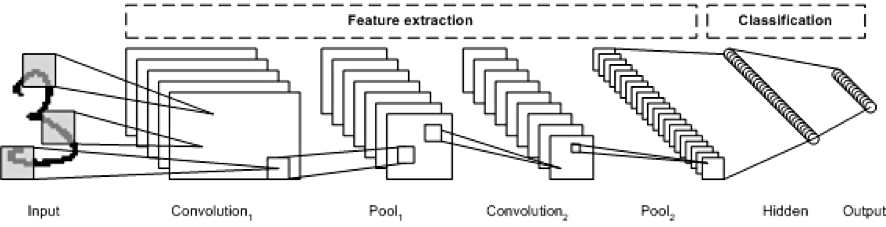
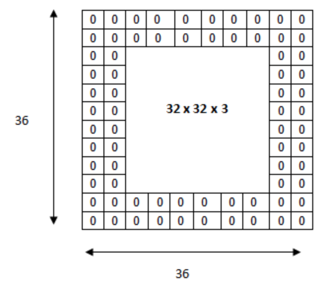

## CNN이란?

CNN이란 Convolutional Neural Network의 약자이다. 우리가 기존에 배웠던 방법들은 Fully Connected Layer만으로 구성된 인공 신경망이고, 이는 모두 1차원의 데이터를 활용한다. 하지만, 이미지나 영상과 같은 데이터는 3차원이고(2차원이라고 착각할 수 있지만 이미지는 2차원 배열의 r, g, b, a channel로 표현이된다.), 이를 활용하기 위해서는 3차원 데이터를 1차원으로 편면화 시켜야 한다. 이를 위하여 나온 이론이 CNN이다.

위 그림이 CNN의 개요이다.

## Filter 그리고 Convolution

어떠한 이미지가 존재한다. 위 이미지 자체로 우리는 데이터로서 ML을 진행할 수 있다. 하지만 위 이미지를 우리는 가공을 하여 더욱 많은 데이터를 만들 수 있고, 그것을 기반으로 ML을 진행한다면 더욱 큰 효과를 기대할 수 있을 것이다. 이러한 과정에서 사용되는 것이 filter이다. 즉, 우리는 filter를 통해 이미지를 새로운 데이터들로 가공을 할 수 있고, 이러한 필터의 갯수는 임의로 정해서 여러개의 데이터를 생성 가능하다. 그리고 filter는 kernel이라고도 불린다. 그리고 이러한 filter를 사용해서 새로운 데이터를 만들어내는 과정을 convolution이라고 한다. 아래 그림을 살펴보자.

위 그림은 3*3의 filter를 통해 stride를 1로 convolution을 진행한 것이다. stride란 필터를 움직이면서 새로운 데이터를 만들 때 얼마큼 움직이면서 만들어내는 것이냐를 결정하는 수치이다. 즉, stride가 1이라는 것은 filter를 한칸 씩 움직여서 계산을 진행한 것이다. convolution에서 filter를 통한 계산은 아래와 같이 정의가 된다. 

즉, 각 filter에 해당하는 칸들의 이미지의 값을 곱한 것들의 합이다. 그러면 새롭게 만들어지는 데이터의 크기는 (원래 데이터 길이 - 필터 길이) / stride + 1로 각각 row, column을 가진다는 것을 알 수 있다. 이를 이해한다면 앞서 살펴본 그림을 이해할 수 있을 것이다.

## Padding이란?

앞서 말한 것처럼 convolution 과정을 진행하면 우리가 가지는 새로운 데이터의 row, column은 (원래 데이터 길이 - 필터 길이) / stride + 1으로 계산이 되어 작아진 크기의 데이터가 나오는 것을 알 수 있다. 이러한 작아짐을 방지하기 위해서 padding을 원 데이터의 주변에 0을 채워넣어 filter를 통한 convolution을 진행하더라도 같은 원래의 데이터와 같은 크기로 만들어지게 보정을 할 수 있다. 아래 그림을 살펴보면, 더욱 정확한 이해를 할 수 있을 것이다.

## Pooling이란?

Pooling이란 convolution의 결과를 일정한 비율로 작게 만드는 작업이다. convolution을 통한 데이터의 크기를 줄이거나 특정 데이터를 강조하기 위하여 사용이 된다. 앞서 배웠던 filter와 stride의 개념이 모두 다시 사용이 되어 진행이 된다. 대표적으로 filter의 크기 내에서 가장 큰 값을 고르는 Max Pooling, filter내의 값들의 평균을 구하는 Average Pooling이 존재한다.

위 그림은 2*2의 filter로 stride가 2인 pooling을 진행한 예이다.