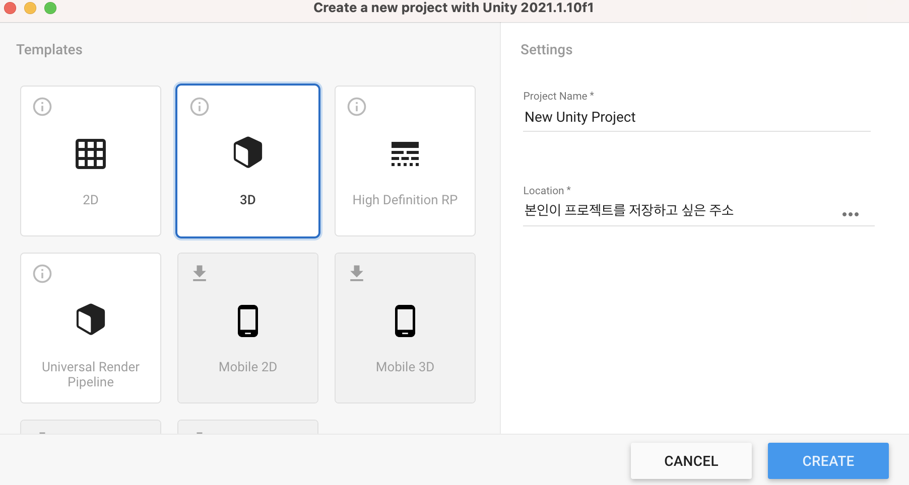
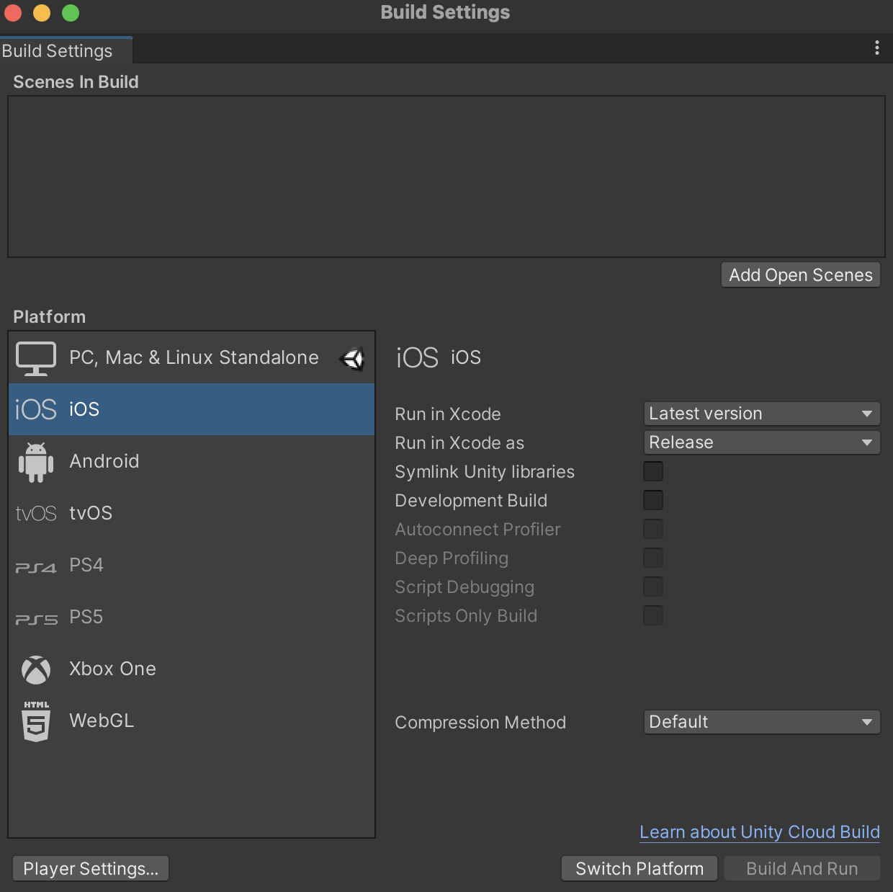
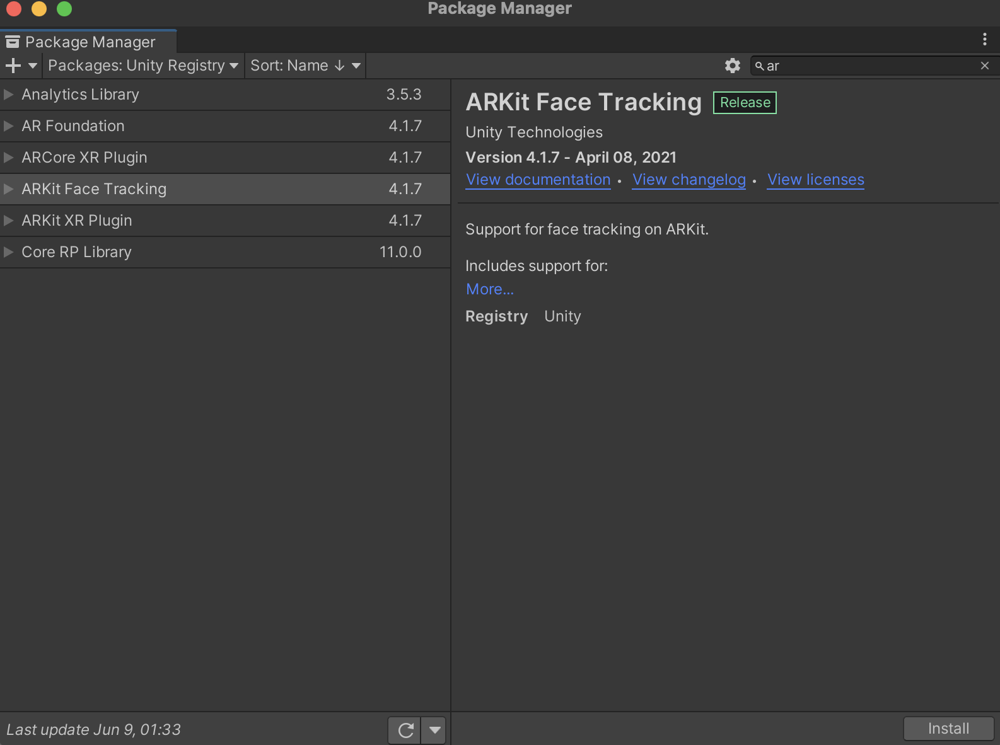
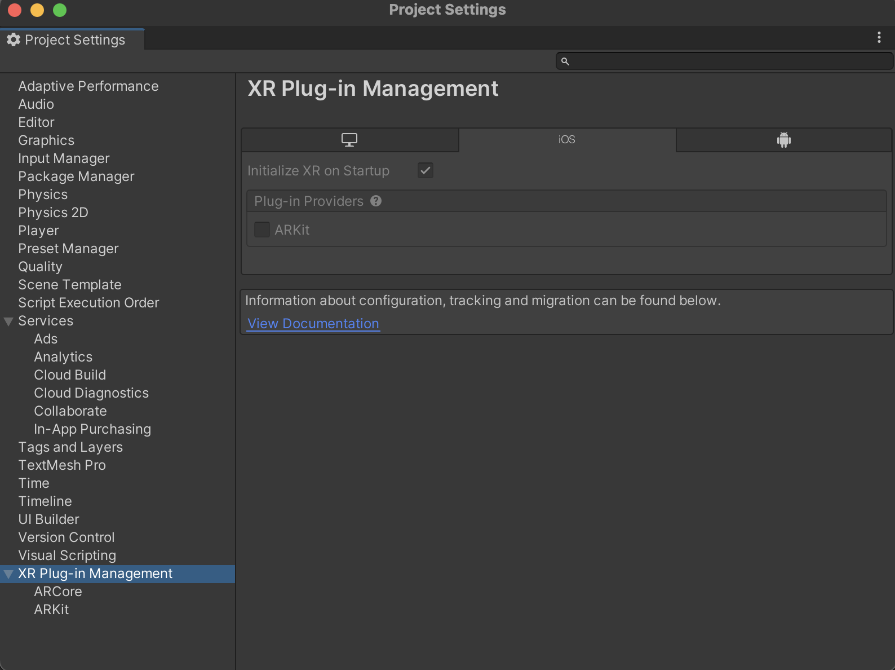
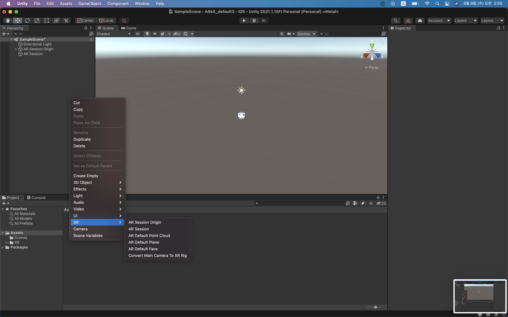

## AR Foundation이란?

AR과 관련된 네이티브 애플리케이션을 개발 하려면 ios에서는 ARKit를, android에서는 ARCore를 사용해야한다. unity AR Foundation은 이러한 제한상황을 상쇄하여 크로스 플랫폼을 만들어줄 수 있는 프레임워크이다.

## 개발환경 구축

우선 [unity 다운로드 사이트](https://unity3d.com/kr/get-unity/download)에서 unity 최신 버전을 설치한다. unity hub를 설치하고, unity hub를 통하여 설치를 하여도 된다.

1. 프로젝트 생성

    
    Templates는 3D로 설정하고, 본인이 작명하고 싶은 프로젝트 명과 프로젝트를 저장할 경로를 기입하고, create한다.

2. Build Settings

    
    File -> Build Settings를 클릭 후, 빌드하고자 하는 플랫폼을 선택한다. 만약 설치되어 있지 않다면 설치를 진행한 후, 우측하단 Switch Platform을 클릭한다.

3. Package Manager

    
    Window -> Package Manager 클릭 후, 좌승상단 Packages에서 Unity Registry를 선택한다. 그리고 ar을 검색해보면 위의 그림과 같이 나타난다. 여기에서 우리는 AR Foundation을 설치하고, android를 위해 ARCore XR Plugin을, ios를 위해 ARKit Face Tracking, ARKit XR Plugin을 설치한다.(ARKit Face Tracking를 ARKit XR Plugin보다 먼저 설치한다면, 자동으로 ARKit XR Plugin이 설치될 것이다.)

4. Project Settings

    
    Edit -> Project Setting를 클릭 후, 하단 XR Plug-in Management에서 ios, android 란에서 각각 ARKit, ARCore를 활성화 시킨다. 첨언을 하자면, XR Plug-in Management 밑에 있는 ARCore와 ARKit에서 Requirement에서 필수적으로 사용을 할 것인지, 선택적으로 사용을 할 것인지를 정할 수 있다.

    

5. Hierarchy

    
    위 사진처럼 Hierarchy에서 오른쪽 마우스 클릭 후, XR 란에서 AR Session Origin, AR Session을 클릭하여 포함시킨다. 그리고 그림 상에는 나와있지 않지만 기존에 Main Camera가 포함되어 있었을 것인데, 이를 삭제한다(AR Session Origin 안에 AR Camera가 포함되어있다.).
