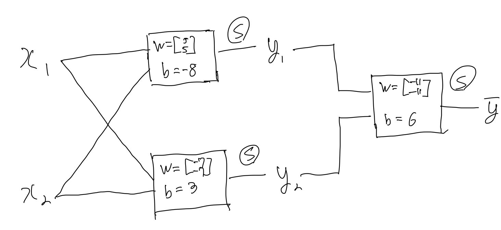
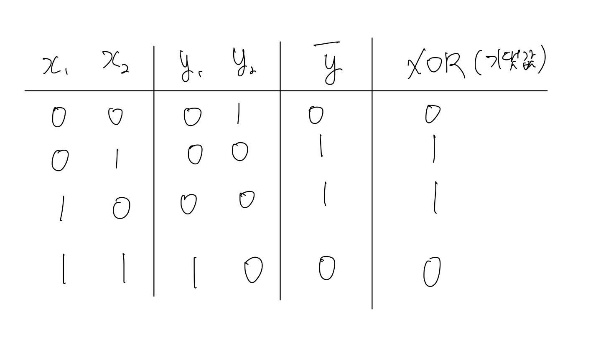
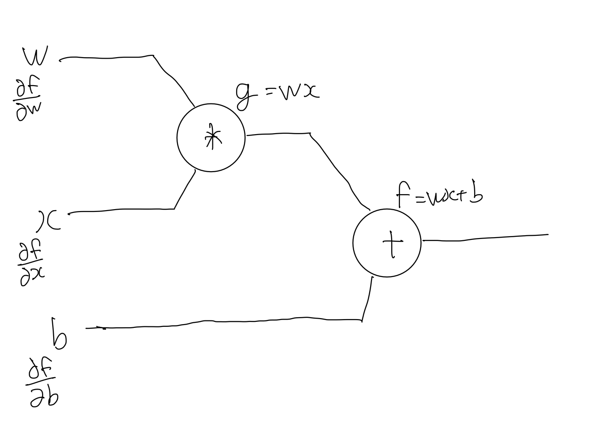

## Forward Propagation이란?

Forward Propagation이란 앞으로, 즉 layer가 나아가는 정방향으로의 propagation을 의미한다. 그러함에 따라 neural network 모델의 입력층부터 출력층까지 순서대로 변수들을 계산하고 저장하는 것을 의미한다. 이해를 쉽게 하기 위해 xor에서의 forward propagation을 생각하여보자. XOR에 대한 모델을 아래와 같이 만들었다고 가정하자.

위 모델이 XOR과 똑같이 동작을 하는지를 확인해 보기 위해서는 각각의 input 값에 대해서 이론값과 같은 값이 나오는지를 검증해봐야 할 것이다. 그리고 이를 확인하기 위하여 forward propagation을 이용하여 table을 그려보면 아래와 같이 나온다.

위를 살펴보면 각각의 layer에서 출력되는 모든 값을 순서대로 계산을 진행하고, 최종값을 도출하였다. 이를 우리는 forward propagation이라고 말한다.

## Back Propagation이란?

Back Propagation이란 뒤로, 즉 역방향으로의 propagation을 의미한다. 이를 통하여 우리는 독립변수가 loss function에서의 기울기에 얼마나 영향을 미치는지를 계산을 할 수 있다. 우리가 학습을 진행하기 위해서는 loss function에 대해 optimizer를 통하여 최적의 값을 찾는다. 만약 이것을 정방향으로 생각을 하게 된다면, 이는 풀리지 않는 난제가 되기에 이를 역방향으로 생각하여 loss function에 대해 독립변수가 얼마나 영향을 미치는가를 계산하는 방법이 고안되었고, 이것이 Back Propagation이다. Back Propagation으로 문제에 대해 접근을 하기 위해서는 우리는 chain rule에 대한 이해가 필요하다. 아래의 식을 살펴보자.

위를 식을 살펴보면 chain rule이란 함수에 대한 미분을 나누어(chain) 계산을 할 수 있는 공식이라는 것을 알 수 있다. 이러한 chain rule을 back propagation에서 활용하는 예를 살펴보자.

위와 같은 가설식에 대해 chain rule을 적용하여 보자. 우리는 위 수식을 위와 같이 나누어 정의할 수 있다.

그리고 이것을 그림으로 나타내면 아래와 같을 것이다.

우리는 w, x, b의 gradient를 찾는 것이 목표이고, 이를 chain rule로 나타내어 보면 아래와 같이 나올 것이다.

위와 같이 loss function에 대한 독립변수의 gradient를 찾는 방법이 back propagation이다.