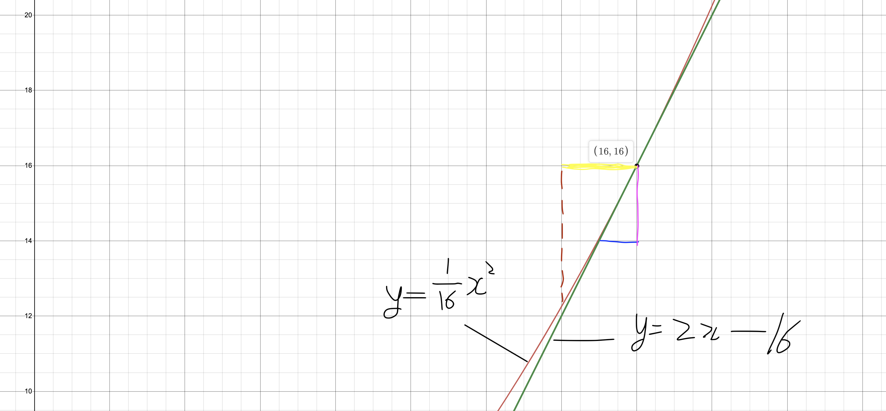

## Learning rate란?

loss function에서 최소값을 가지는 지점을 찾을 때 gradient descent algorithm을 기반으로 찾는다고 하였다. 이것은 기울기가 0이 되는 지점이 최소가 되는 것을 기반으로 한 알고리즘이다. 그렇기 때문에 현재 위치의 기울기를 바탕으로 어느 방향으로 이동할지가 정해진다. 그리고 얼마만큼 이동해야할지 또한 정해야한다. 얼만만큼 이동해야할지를 아는 것에서 우리가 설정한 learning rate의 값이 사용된다. 아래의 식을 보면 이해가 쉬울 것이다.

아직 이해가 어려울 수 있으니 이를 좌표계에서 예시를 들어 살펴보자.

상단 그림의 (16,16) 좌표에서의 기울기는 2이다. 그리고 learning rate를 2로 가정해보자. 그렇다면 자홍색 실선의 길이 -2 * 2 = -4만큼 x축으로 노란 실선만큼 이동을 한 곳의 x좌표가 다음으로 탐색할 좌표가 될 것이다.

## 적절한 Learning rate를 대입하여야 한다.

만약 Learning rate가 매우 작다면, 다음 탐색 좌표로 매우 적은 이동을 보일 것이다. 만약 우리가 위를 시행하는 횟수 제한(제한시간)이 무한이라면 Learning rate가 작을수록 더욱 정밀한 해를 찾을 수 있을 것이다. 그러나 시행 횟수를 무한이라고 가정하는 것은 말이 안된다. 즉, 우리는 유한한 횟수 내에서 최적의 해를 찾아야한다. 그렇기 때문에 Learning rate를 작게 설정한다면 시간적인 문제가 생길 것이다.

반면에 Learning rate가 매우 크다면, 다음 탐색 좌표로 매우 큰 이동을 보일 것이다. 이는 더욱 큰 문제를 야기할 수 있다. 한 step마다 매우 큰 이동을 하므로 최적의 해를 찾아가는 것이 아니라 그래프를 벗어나거나, 최적의 해 사이를 왔다갔다하는 step 양상을 보일 수 있다. 이는 시간이 무한으로 주더라도 최적의 해를 찾지 못할 것이다. 이러한 현상을 overshooting라고 부른다.

결론적으로 우리는 시간적 문제와 정확도, 두 마리의 토끼를 잡을 수 있는 최적은 Learning rate를 설정하여야 할 것이다.

