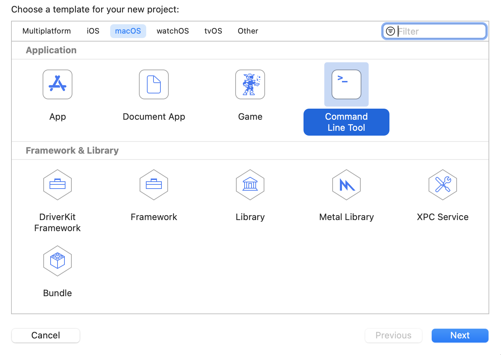
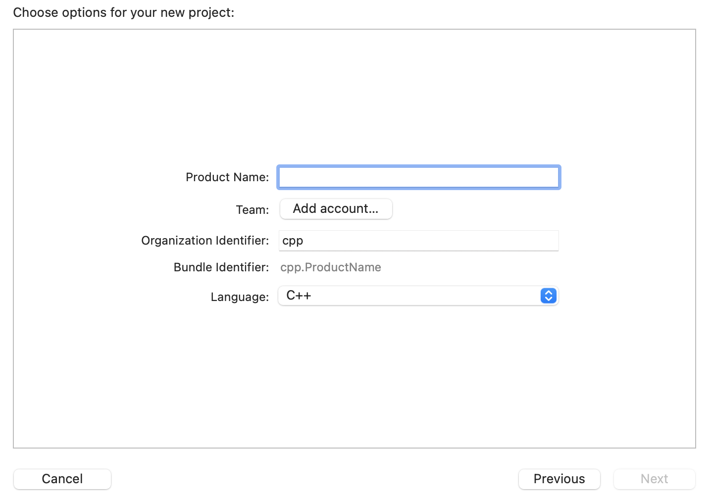
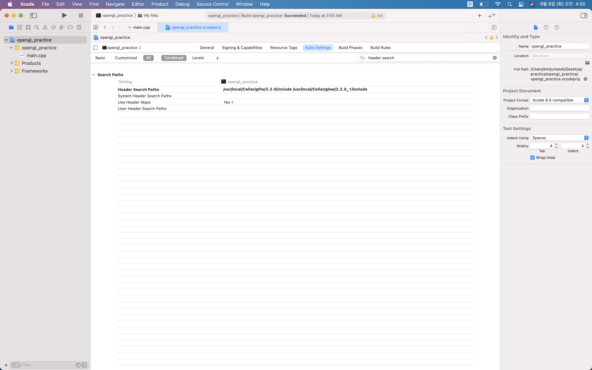
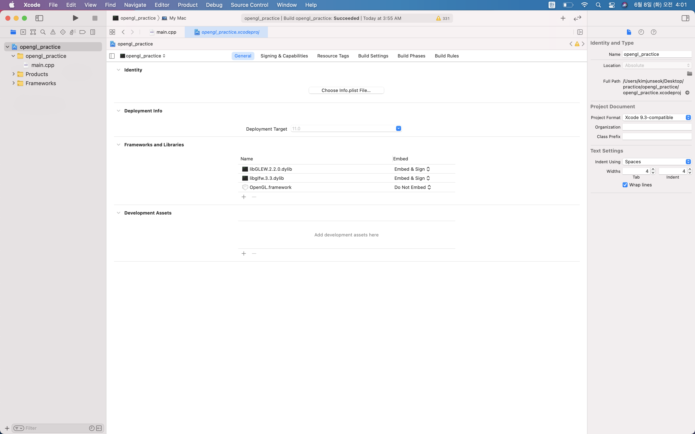
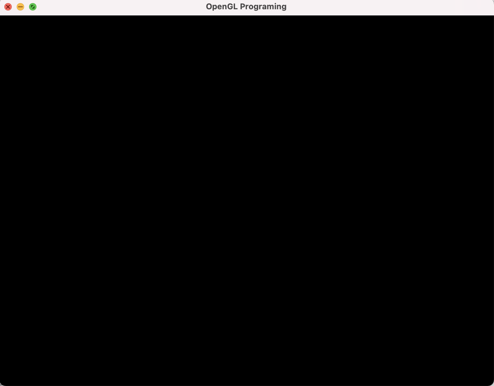

## macOS에서의 개발환경 구축

위 게시글은 macOS를 기준으로 작성이 되어 있다. 만약 다른 OS에서 OpenGL 개발환경 구축을 진행하여야한다면, 다른 게시글을 살펴봐야 한다.

## 개발환경 구축

macOS에는 OpenGL 라이브러리가 이미 존재한다. 이에 대해서는 추가적인 설치가 필요 없다.

1. Homebrew 설치
    
    Homebrew를 통하여 2번 단계인 GLFW와 GLEW 라이브러리를 설치하여야한다. 만약 이미 설치가 되어있다면, 위 단계는 건너 뛰면 된다. 터미널을 열고, 

         /bin/bash -c "$(curl -fsSL https://raw.githubusercontent.com/Homebrew/install/HEAD/install.sh)"
    
    위 명령어를 실행한다면, Homebrew 설치가 완료 된다. 자세한 내용은 [Homebrew 사이트](https://brew.sh/index_ko)를 참고하면 된다.

2. GLFW, GLEW 설치

    터미널에 각각

        brew install glfw
        brew install glew
    
    라는 명령어를 실행하면 된다.<br><br>
    *GLFW란?*  
    - glut의 하나로 크로스 플랫폼을 구현하기 위해 사용해야 하는 라이브러리이다. 또한 OpenGL은 창 생성 또는 입력을 처리하지 않으므로, 이를 처리하기 위하여 필요하다.<br>

    *GLEW란?*
    - Glew는 최신 OpenGL API 함수 (버전 3.2에서 최신 버전까지)에 액세스하는 데 사용된다. OpenGL도 시대를 거쳐가며 많은 발전 및 수정이 이루어졌고, 대표적인 예로 glbegin과 glend와 같은 비효율적인 방식을 탈피하는 쪽으로 발전을 하였다. 검색을 해본다면, 많은 자료들이 이를 아직까지 활용하고, 필자의 대학 그래픽스 전공 수업에서도(수강을 하지는 않았지만 추가적인 공부를 위해 살펴보았다.) 아직 예전 버전의 OpenGL을 기준으로 강의를 하고 있는 것을 확인할 수 있었다. 공부의 목적은 실무 기초 향상이기에 과거의 방식을 지양하기 위하여 이를 사용할 것이다.

3. Xcode를 통한 환경 구축

    macOS에서는 Xcode를 통하여 개발환경을 구축한다. 
    
    macOS, Command Line Tool을 선택한다.
    
    언어는 당연히 c++로 선택하여 진행한다.
    
    프로젝트 설정 Build Setting란에서 Header Search Paths항목에 GLFW, GLEW가 존재하는 파일의 경로

        /usr/local/Cellar/glfw/{version}/include
        /usr/local/Cellar/glew/{version}/include

    를 추가한다.        
    
    프로젝트 설정 General란에서 Frameworks and Libraries항목에 GLFW, GLEW, OpenGL을 추가한다.(위의 그림처럼 GLFW, GLEW의 .dylib 파일을 추가하여야 한다. 파일 경로 검색을 통해 /usr/local/Cellar/에서 GLFW, GLEW의 폴더에서 찾으면 수월할 것이다.)


4. 실험 코드

    ```c++

    #define GLEW_STATIC

    #include <iostream>
    #include <GL/glew.h>
    #include <GLFW/glfw3.h>

    const GLuint WIDTH = 800;
    const GLuint HEIGHT = 600;
    const GLchar *TITLE = "OpenGL Programing";

    int main(){ 
        if(!glfwInit()){
            std::cout << "FAILED TO INITIALIZE GLFW" << std::endl;
            exit(0);
        }
    
        glfwWindowHint(GLFW_CONTEXT_VERSION_MAJOR, 3);
        glfwWindowHint(GLFW_CONTEXT_VERSION_MINOR, 3);
        glfwWindowHint(GLFW_OPENGL_PROFILE, GLFW_OPENGL_CORE_PROFILE);
    
        #ifdef __APPLE__
        glfwWindowHint(GLFW_OPENGL_FORWARD_COMPAT, GL_TRUE);
        #endif
    
        GLFWwindow *window = glfwCreateWindow(WIDTH, HEIGHT, TITLE, NULL, NULL);
    
        if(!window){
            std::cout << "FAILED TO CREATE WINDOW" << std::endl;
            glfwTerminate();
            exit(0);
        }
    
        glfwMakeContextCurrent(window);
    
        glewExperimental = true;
        if(glewInit() != GLEW_OK){
            std::cout << "FAILED TO INITIALIZE GLEW" << std::endl;
            glfwTerminate();
            exit(0);
        }
    
        GLint windowWIDTH, windowHEIGHT;
        glfwGetFramebufferSize(window, &windowWIDTH, &windowHEIGHT);
        glViewport(0, 0, windowWIDTH, windowHEIGHT);
    
        glClearColor(0.0, 0.0, 0.0, 0.0);
   
        while(!glfwWindowShouldClose(window)){
            glClear(GL_COLOR_BUFFER_BIT);
        
            glfwPollEvents();
        
            //render here
        
            glfwSwapBuffers(window);
        }
    
        glfwTerminate();
        exit(0);
    
    }


    ```

    위 코드를 작성하여 실행을 시켜본다면,
    
    

    위와 같이 검은 화면 창이 뜰 것이고, 이는 코드의 의도대로 수행이 된것이다. 위와 같은 방식으로 개발 환경을 구축하면 된다.