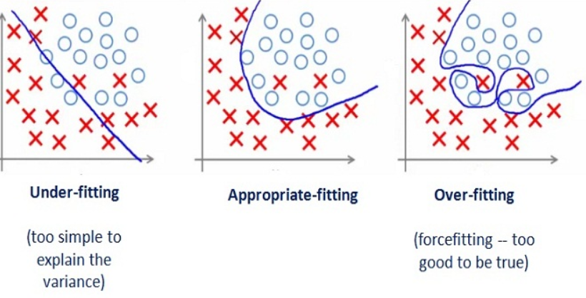
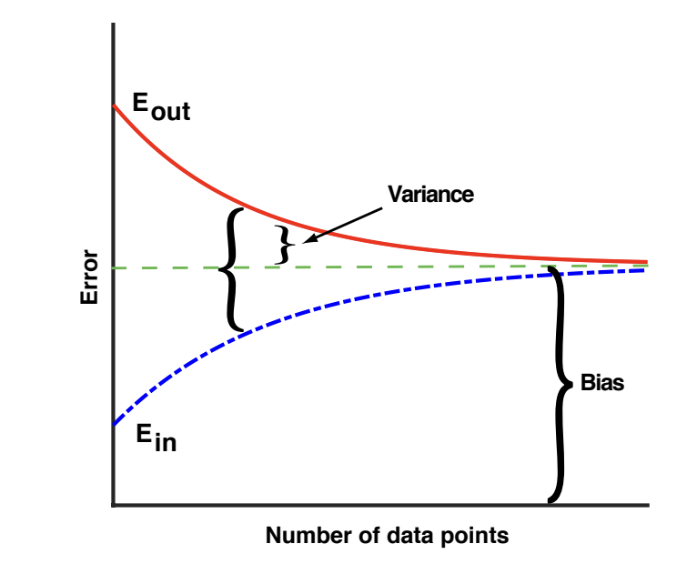
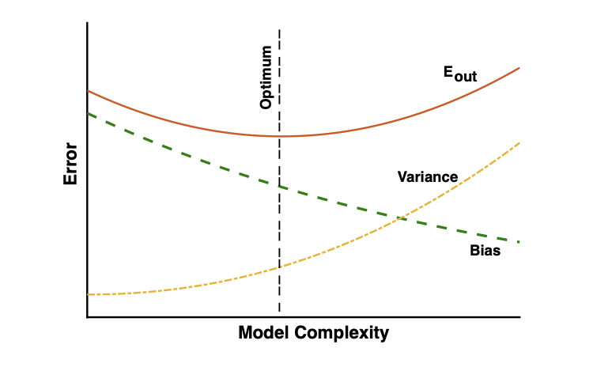

## Overfitting이란?

Overfitting이란 단어에서 살펴볼 수 있듯이 training set에 대해 과하게 fit이 된 경우를 일컫는다. 아래 그림을 살펴보면 이해가 빠를 것이다.

위 그림에서 3번째, overfitting 란을 살펴보면 training set에 대해서 100%의 accuracy를 만족하기 위해서 매우 복잡한 그래프를 설정한 것을 알 수 있다. 즉, model complexity를 높여서 training set에 대한 accuracy를 높이는 것이다. 하지만 이러한 복잡한 모델 구조를 가지게 된다면, test set에 대한 accuracy는 떨어지게 된다. 이러한 이유를 논리적으로 살펴보자. 우선 아래의 그림을 살펴보자.

위의 그래프는 dataset의 양에 따른 error의 상관관계를 나타내는 그래프이다. 우리가 여기서 확인 하여야 할 것은 variance와 bias의 개념이다. 우선적으로 variance에 대한 개념을 살펴본다면, variance 란 test set에 모델을 대입했을 때의 error와 training set에 모델을 대입했을 때의 error의 차이이다(물론 엄밀한 이론은 위와 같지 않지만 쉬운 이해를 위해 위처럼 생각을 하여도 된다.). 그리고 bias란 무한히 많은 양의 data를 가지고 있다면 variance 란 test set에 모델을 대입했을 때의 error와 training set에 모델을 대입했을 때의 error는 어느 부분에서 수렴할 것이고, 이러한 error의 수치를 bias라고 한다(앞서 배웠던 가설식의 bias와 단어는 같지만 다른 뜻으로 쓰인다는 것을 알아야한다.). 이제 위 두 개념을 알고 아래 그림을 살펴보자.

위 그림은 모델의 복잡도에 대해서 error 수치의 상관관계를 나타낸 그래프이다. 위 그래프와 같이 모델이 복잡해짐에 따라 bias는 내려가게 될 것이고, variance는 올라갈 것이다. 그러면 bias와 variance가 서로 만나게 되는 Bias-Variance tradeoff 현상이 나타나게 되고, 이를 바탕으로 test set에 대한 error율은 올라가게 된다. 즉, 우리는 모델이 복잡해지는 것, overfitting을 막아야지 실제 세계에서 사용하였을 때, 높은 accuracy를 기대할 수 있는 모델을 만들 수 있을 것이다.

## Solutions for Overfitting

우리가 overfitting을 방지하기 위한 방법들은 크게 아래와 같다.

### training dataset의 수를 늘린다.

앞서 서술한 내용에 대해 이해를 하였다면, 쉽게 알 수 있을 것이다. 데이터의 수가 많아질 수록 variance는 작아질 것이고, test set에 대한 error율은 낮아질 것이다.

### 특징의 갯수를 줄인다.

overfitting이 발생하는 이유 중 하나는 training set에서 특이한 수치에 대해서도 fit한 모델을 만들기 위해서 overfitting을 하는 것에서 발생한다. 그러므로 이러한 특징의 갯수를 줄여 overfitting을 방지할 수 있다.

### Regularization

복잡한 모델을 가지고 있다는 것은 우리가 세운 가설식에서 weight가 큰 값을 가진다는 것을 의미한다. 이를 바꿔 생각하여 보면, weight가 큰 값을 가지지 못하게 하여 overfitting을 막으면 된다. 그러면 큰 weight 값들을 갖지 못하게 막기 위해서는 어떻게 해야할까? 머신러닝이란 결국 loss function에서 최소의 값을 가질 때의 weight을 찾는 과정이다. 그러면 이러한 loss function에 weight 값에 대한 패널티를 준다면, 우리는 큰 weight 값을 가지지 못하게 막을 수 있을 것이다. 대표적으로 아래와 같이 loss function을 설정한다면, 우리는 overfitting을 막을 수 있을 것이다.

위의 식에서 우리가 살펴보아야 할 것은 기존의 loss function에서 덧셈을 통해 추가한 뒷 부분이다. weight의 값들에 대해 제곱을 하고, 그 값들을 더한 다음, 우리가 설정할 수 있는 lambda 값을 곱한 것을 기존의 loss function에 덧셈으로 추가하여 weight에 대한 패널티를 주었고, 이를 통해 우리는 weight가 큰 값을 가지는 것을 막는, 즉, overfitting을 막을 수 있게 되는 것이다.