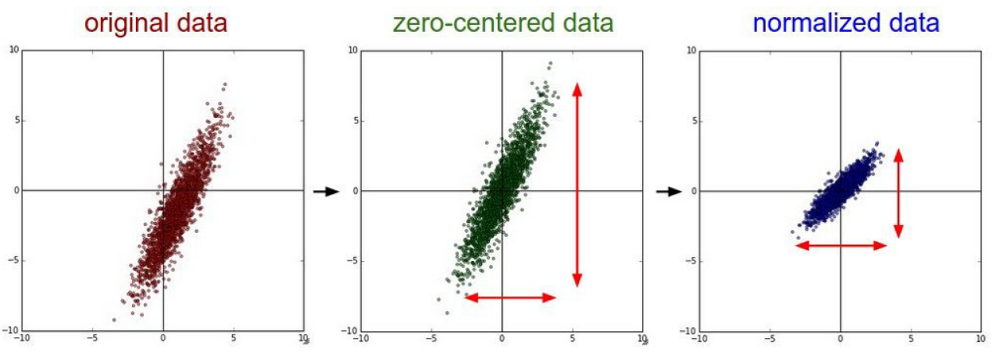

## Data preprocessing이란?

Data preprocessing을 직역하면 말그대로 데이터 전처리이다. 즉, 우리가 사용할 데이터에 대해 machine learning을 돌렸을 때, 더욱 간결하고, 객관적인 해답을 도출하기 위해 데이터 셋을 가공하는 것이다. 예를 들어 아래와 같은 데이터 셋이 있다고 가정하자.

|X1|X2|Y|
|:---|:---:|:---:|
|1|3000|0|
|2|4000|0|
|3|5000|0|
|4|-1000|1|
|5|-2000|1|
|50|-10000|1|

위 데이터의 특징은 독립변수 x1, x2의 차이가 엄청 난다는 것이다. 위와 같은 상황에서의 loss function을 고려해보고, 이에 대해 gradient descent algorithm을 적용하여 생각하여 봤을 때, 우리는 크나큰 문제에 직면할 수 있다. x1, x2의 차이가 크다는 것은 weight w1, w2에 대해서도 큰 차이가 나올 수 있다는 것이다. 즉, 이에 대한 loss function을 구현하여 최소의 loss를 가지는 지점을 찾기 위해서 gradient descent algorithm을 통하여 수평 및 수직으로 이동을 할 때, 균형적인 이동이 되지 못하고, 불균형적인 이동을 보일 것이다. 그러므로, learning rate에 따라 overshooting이 발생할 수 있고, 이를 방지하기 위해 learning rate를 줄인다면, 시행 횟수를 더욱 늘려야하는 시간적인 제한이 발생할 수 있다. 즉, Data preprocessing이란 이러한 불균형적일 수 있는 모습을 사전에 데이터 변형을 통하여 균형있는 모습으로 변환을 꾀해 이점을 얻는 방법이다.

### 균형 있는 데이터를 만드려면 어떻게 하여야 할까?

독립 변수가 2개일 때의 데이터 셋을 나타내는 아래 그림을 살펴보자.

첫 번째 그래프가 우리가 초기에 가진 데이터 값, 즉 preprocessing을 진행하지 않은 날 것 상태의 데이터이다. 위 그래프를 살펴보면, 우리는 2가지를 알 수 있다.

* 0에 대해서 중앙을 이루지 않고 한쪽으로 쳐져있다.
* 독립변수의 차이가 커 길게 늘어진 형태의 그래프가 그려진다.

위와 같은 특징은 불균형적인 모습을 만드는 주범이므로, 이를 처리함으로서 우리는 균형적인 모습을 만들어야 한다. 만약 첫 번째 요소에 대해서만 고려를 하여 preprocessing을 진행한다면, 두 번째 그래프와 같은 꼴이 된다. 그리고 두 요소를 모두 고려하여 preprocessing을 진행한다면, 세 번째 그래프와 같은 꼴이 되는 것이다. 즉, 위의 두 요소에 대해 고려를 하여(선택적으로 가능) 우리는 균형 있는 데이터를 만들 수 있다.

## Data preprocessing 기법

기본적으로 앞선 설명한 두 요소를 고려하여 Data preprocessing을 진행하면 된다. 그리고 추가적으로 Data preprocessing에서 유용한 기법을 두 가지 알아보면 아래와 같다.

### Normalization

전체 구간을 0 ~ 100까지의 수로 변경할 수 있는 방법이다. 이에 대한 수식은 아래와 같다.

### Standardization

통계에서의 특정한 분포(ex: 정규 분포)들의 평균과 분산 혹은 표준 편차를 이용하여 변환하는 방법이다.

