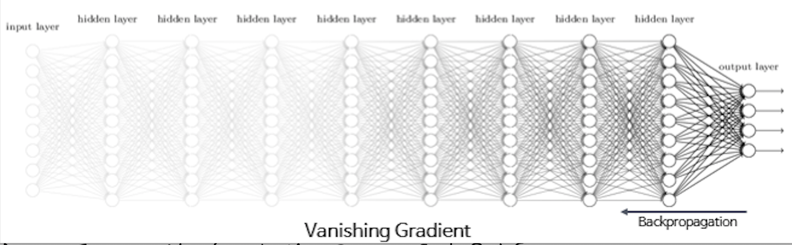

## Vanishing Gradient란?

Vanishing Gradient란 이전에 배운 backpropagation을 진행하여 독립변수가 기울기에 미치는 영향을 살펴볼 때, layer를 거칠 때마다 독립변수가 gradient에 미치는 영향이 미미해지는 현상을 말한다. 즉, 아래 그림과 같은 상황을 얘기한다.

vanishing gradient를 야기하는 조건은 크게 2가지로 나타낼 수 있다.

1. 너무나 많은 layer에 따른 vanishing gradient

    layer마다 각자의 function을 가지고 있고, 이는 각 layer를 거칠 때마다 값에 대한 변형이 이루어진다는 뜻이다. 그러함에 따라 너무나 많은 layer를 가지고 있어 많은 변형이 일어난다면 당연히 초기 값인 독립변수의 loss function의 gradient에 대한 영향도는 미미해질 것이다.

2. Activation Function 선택에 따른 vanishing gradient

    Activation Function이란 신경망의 출력을 결정하는 식을 의미한다. 우리가 배웠던 sigmoid가 대표적인 Activation Function이다. sigmoid function은 아래와 같이 정의되었다.

    

    sigmoid function은 모든 값을 0 ~ 1 사이로 변환을 할 수 있는 함수였다. 이러한 sigmoid function을 미분하여 보자.

    

    위를 살펴보면 미분한 값은 0점 대의 두 값의 곱으로 나타나는 것을 알 수 있다. 이를 통해, 만약 여러개의 layer가 sigmoid로 나타내어 진다면, backpropagation을 진행하였을 때, 독립변수의 loss function의 gradient에 대한 영향도는 미미해질 것이고, vanishing gradient를 야기하게 될 수 있다는 것을 알 수 있다. 

    

## Vanishing Gradient 해결

너무나 당연하게 Vanishing Gradient을 야기하는 원인을 제거하면 된다. 즉, 대표적으로 2가지가 있다고 할 수 있다.

1. 적절한 layer의 갯수를 가진 모델 구현

    layer가 많아진다면 vanishing gradient를 유발할 수 있다. 그렇기 때문에 많은 layer를 사용하는 것이 아니라 효율적인 갯수의 layer를 사용해야 한다.

2. 적절한 Activation Function 선택

    위에서 sigmoid function으로 인한 vanishing grdient 현상의 예를 살펴보았다. 그러므로 vanishing gradient 현상을 막으려면 적절한 activation function을 사용해야한다. 대표적으로 ReLU를 사용하고, 마지막 layer에 대해서만 sigmoid를 사용하는 방법이 존재한다. 아래는 다양한 activation function에 대한 설명이다.

    - ReLU

        Rectified Linear Unit(정류 선형 유닛)으로, 입력값이 0보다 작으면 0으로 출력, 0보다 크면 입력값 그대로 출력하는 유닛이다.

         =&space;0)\\y&space;=&space;0&space;\quad(x&space;<&space;0)\end{cases}&space;" title="\begin{cases}y = x \quad(x >= 0)\\y = 0 \quad(x < 0)\end{cases} " />
    
    - Leaky ReLU

        ReLU에서 x가 음수가 되는 값에 임의로 지정한 상수를 기울기로 가지는 직선의 방정식을 추가한 것이다. 즉, Dying ReLU를 막기 위하여 이를 추가한 것이다.

         =&space;0)\\y&space;=&space;\alpha&space;x&space;\quad(x&space;<&space;0)\end{cases}&space;" title="\begin{cases}y = x \quad\:\:(x >= 0)\\y = \alpha x \quad(x < 0)\end{cases} " />
 
    - tanh

        정의는 아래와 같다.

        

        이는 sigmoid function을 통해서 나타낼 수도 있다.

        

    - Maxout

        ReLU의 장점을 전부 가지고 있으면서, Dying ReLU 현상을 회복한 함수이다. 실제로 성능이 뛰어나지만, 계산량이 복잡하다는 단점이 있다.

        

